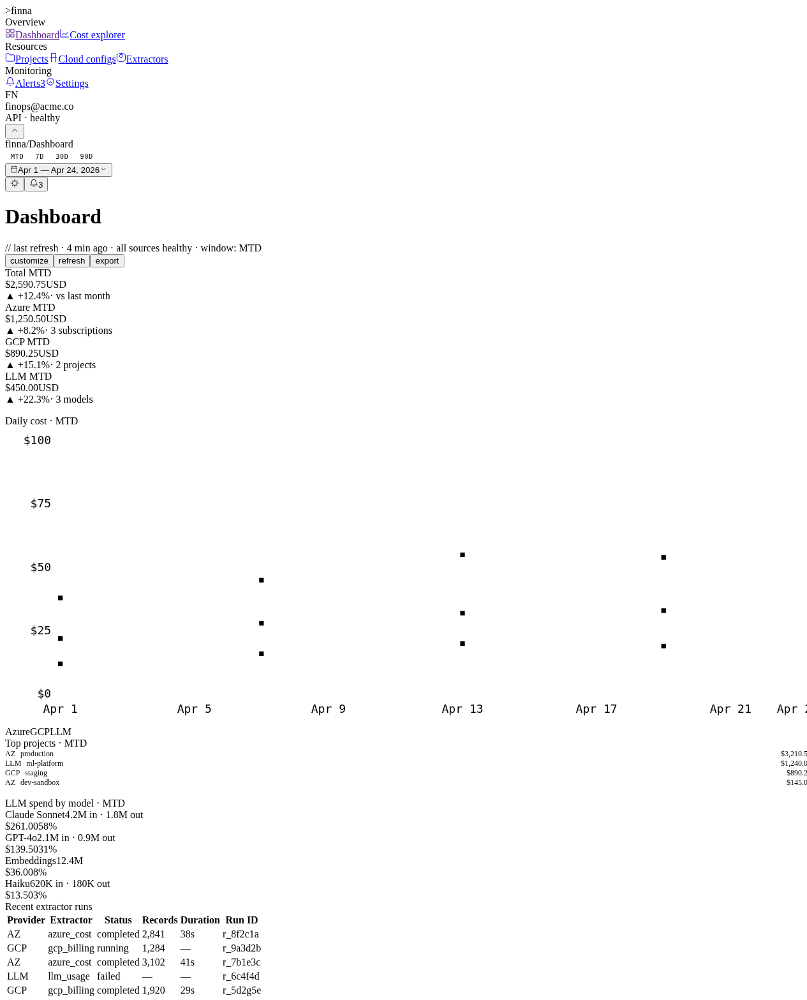

# FinOps Console

**FinOps Console** è una dashboard multi-cloud per il monitoraggio dei costi di Azure, GCP e LLM API.



## Caratteristiche principali

- **Dashboard**: overview MTD/7d/30d/90d con 4 KPI card (Total, Azure, GCP, LLM), trend daily, top projects, LLM spend breakdown, recent extractor runs
- **Projects**: lista progetti con budget cap, % di utilizzo, progress bar colorati (verde <70%, giallo 70-90%, rosso >90%), filtri
- **Cost Explorer**: tabella dettagliata per SKU, raggruppamento by SKU, stacked area chart per provider, filtri multipli
- **Alerts**: stat cards (total/firing/pending/resolved), lista alert con stato, condition, threshold e valore corrente
- **Cloud Configs**: gestione credenziali Azure (service principal, managed identity) e GCP (service account key)
- **Settings**: preferenze utente, notification channels (telegram/slack/email), API keys, retention dati

## Design System

Pixel-art dark theme con:
- Font: `JetBrains Mono` per numeri e label, `Inter` per il testo
- Bordi netti, no shadow, no blur
- Button con bracket style `[label]`
- Colori semantic: `--accent` (primario verde), `--danger` (rosso), `--warning` (giallo), provider badges (`--azure`, `--gcp`, `--llm`)

## Deployment

### Prerequisiti

- Accesso GCP con `gcloud` autenticato: `gcloud auth login`
- Docker installato
- kubectl configurato per il cluster `gke_abs-digital-playground_europe-west1_abs-ces-n8n`

### Build e push

```bash
cd /root/projects/finna-app-ui
npm run build

# Build e push Docker image
docker build -t finna-frontend:latest .
docker tag finna-frontend:latest europe-west1-docker.pkg.dev/abs-digital-playground/finna-app-staging/frontend:latest
docker push europe-west1-docker.pkg.dev/abs-digital-playground/finna-app-staging/frontend:latest

# Rollout su GKE
kubectl rollout restart deployment/finna-console -n finna-app-staging
kubectl rollout status deployment/finna-console -n finna-app-staging --timeout=120s
```

### Endpoints

- **Frontend UI**: `https://finna-app-ui.ces.abssrv.it` ✅ live (2/2 pods ready)
- **Backend API**: `https://finna-app.ces.abssrv.it/api/v1`
- **Namespace GKE**: `finna-app-staging`
- **Ingress**: Traefik con TLS su 34.79.180.243

### Login

```
Username: admin
Password: admin
```

## Pagina aggiuntive (tutte implementate)

- `/projects/:slug` — dettagio progetto con breakdown SKU
- `/configs/new` — wizard 3 step per nuova configurazione cloud
- `/runs` — storico run degli extractor
- `/sources` — elenco data sources con health status

---

*Build timestamp: 2026-04-28*
*Docker image: `europe-west1-docker.pkg.dev/abs-digital-playground/finna-app-staging/frontend:latest`*
