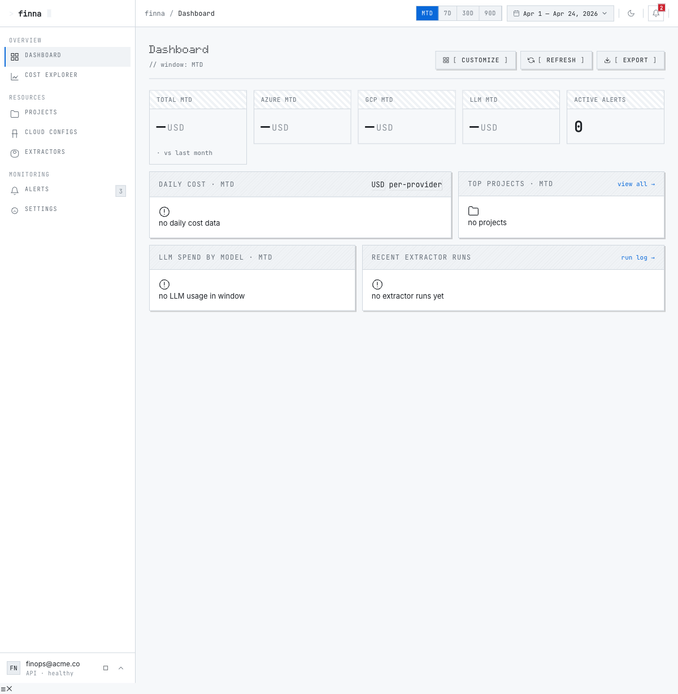

# FinOps Console

**FinOps Console** è una dashboard multi-cloud per il monitoraggio dei costi di Azure, GCP e LLM API.




## Caratteristiche principali

- **Dashboard**: overview MTD/7d/30d/90d con 5 KPI card (Total, Azure, GCP, LLM, Alerts), trend daily, top projects, LLM spend breakdown, recent extractor runs
- **Projects**: lista progetti con budget cap, % di utilizzo, progress bar colorati (verde <70%, giallo 70-90%, rosso >90%), filtri
- **Cost Explorer**: tabella dettagliata per SKU, raggruppamento by SKU, stacked area chart per provider, filtri multipli
- **Alerts**: stat cards (total/firing/pending/resolved), lista alert con stato, condition, threshold e valore corrente
- **Cloud Configs**: wizard 3-step per Azure (service principal, managed identity, cli, device_code) e GCP (service account key, cli)
- **Settings**: preferenze utente, notification channels (telegram/slack/email), API keys, retention dati
- **Extractors**: gestione extractor con status e ultimi run
- **Run History**: storico completo con status, durata, records estratti

## Design System

Pixel-art dark theme con:
- **Font**: `Doto` per titoli H1 (28px, 800 weight), `JetBrains Mono` per numeri/label/button (11px uppercase), `Inter` per body
- **Bordi**: netti (radius: 0), 1px solid borders ovunque
- **Shadow**: pixel-step shadows (no blur) — `2px 2px 0`, `3px 3px 0`, `4px 4px 0`
- **Buttons**: bracket style `[ LABEL ]` con animazione press su hover/click
- **Scanlines**: overlay CRT su dark theme (`data-theme="dark"`)
- **Colori**: semantic `--accent` (verde #3fb950), `--danger` (rosso #f85149), `--warning` (giallo #e3b341), provider badges (`--azure` #0078d4, `--gcp` #ea4335, `--llm` #7c3aed)
- **Stat cards**: header con dithered pattern, valore in JetBrains Mono 26px tabular


## Stack

- **Frontend**: React 18 + TypeScript + Vite + Tailwind v4 + shadcn/ui
- **State**: Zustand + React Query
- **Routing**: hash-based (`#/dashboard`, `#/projects`, etc.)
- **Auth**: JWT in localStorage (`finna_token`), login base `admin/admin`
- **Backend proxy**: Vite dev server `/api` → `http://localhost:8000`

## Comandi

```bash
npm run dev      # Dev server su http://localhost:5173
npm run build    # TypeScript check + Vite build → dist/
npm run preview  # Preview build locale
```

## Deployment

### Prerequisiti

- Accesso GCP con `gcloud` autenticato: `gcloud auth login`
- Docker installato
- kubectl configurato per il cluster `<gke-cluster-name>`

### Build e push

```bash
npm run build

# Build e push Docker image
docker build -t finna-frontend:latest .
docker tag finna-frontend:latest europe-west1-docker.pkg.dev/<gcp-project-id>/finna-app-staging/frontend:latest
docker push europe-west1-docker.pkg.dev/<gcp-project-id>/finna-app-staging/frontend:latest

# Rollout su GKE
kubectl rollout restart deployment/finna-console -n finna-app-staging
kubectl rollout status deployment/finna-console -n finna-app-staging --timeout=120s
```

### Endpoints

- **Frontend UI**: `https://<your-domain>`
- **Backend API**: `https://<your-domain>/api/v1`
- **Namespace GKE**: `finna-app-staging`
- **Ingress**: Traefik con TLS su 34.79.180.243

### Login

```
Username: admin
Password: admin
```

## Route

| Path | Pagina |
|------|--------|
| `#/dashboard` | DashboardPage |
| `#/projects` | ProjectsListPage |
| `#/projects/:slug` | ProjectDetailPage |
| `#/costs` | CostsPage |
| `#/configs` | ConfigsListPage |
| `#/configs/new` | ConfigCreatePage (wizard 3-step) |
| `#/configs/:id` | ConfigCreatePage (edit) |
| `#/alerts` | AlertsPage |
| `#/settings` | SettingsPage |
| `#/runs` | RunHistoryPage |
| `#/sources` | DataSourcesPage |
| `#/extractors` | ExtractorsPage |

---

*Build timestamp: 2026-04-30*
*Docker image: `europe-west1-docker.pkg.dev/<gcp-project-id>/finna-app-staging/frontend:latest`*
